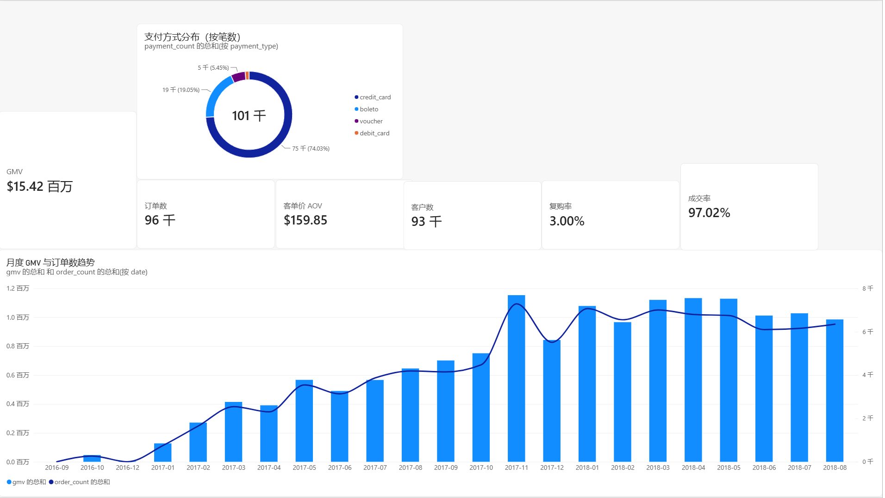
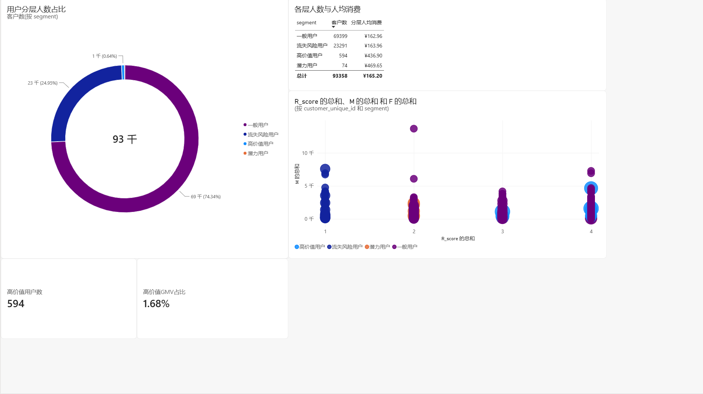
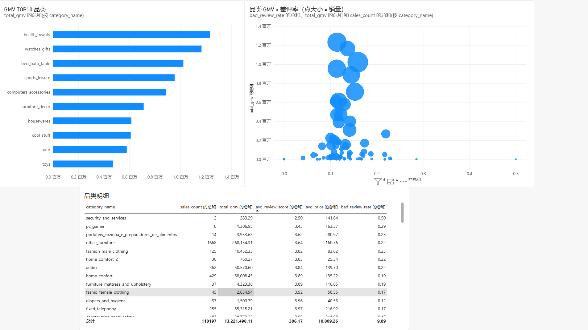
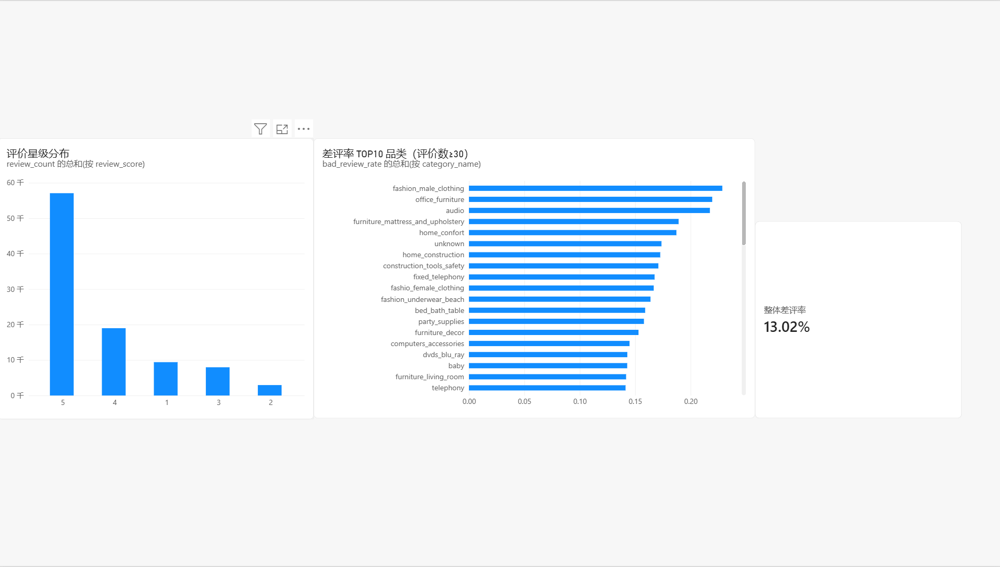

# 电商用户行为与销售数据分析（Olist 巴西电商 BI 项目）

> Python（pandas）数据清洗 + RFM 用户分层 + Power BI 交互式看板，完整的电商数据分析作品集项目。

## 看板预览（Power BI Desktop 制作）

> 截图待补充：将 4 页看板截图放入 `screenshots/` 目录后，取消下面注释即可在 GitHub 首页直接展示。

<!--
| 销售总览 | 用户分层 |
|---|---|
|  |  |

| 品类分析 | 评价分布 |
|---|---|
|  |  |
-->

## 一、项目简介

基于 Kaggle 公开数据集 **Brazilian E-commerce Public Dataset by Olist**，使用 Python（pandas/numpy）完成数据加载、质量检查、清洗、特征工程与指标计算，输出 9 张干净的分析型 CSV，供 Power BI / Tableau Public / FineBI 制作交互式看板。

- 数据规模：99,441 个订单、112,650 条商品明细、约 9.6 万客户、3,295 个 SKU、73 个商品品类
- 时间跨度：2016-09 至 2018-10（分析基准日 = 最后一个订单日期 **2018-10-17**）
- 统一分析口径：**已交付订单（order_status = 'delivered'，96,478 单）**
- 核心方法：RFM 用户分层、销售时间趋势、品类销售/评价交叉分析、订单状态粗略转化

## 二、数据来源声明

- 数据集：[Brazilian E-commerce Public Dataset by Olist](https://www.kaggle.com/datasets/olistbr/brazilian-ecommerce)（Kaggle，Olist 官方发布，CC BY-NC-SA 4.0）
- 本项目仅用于学习与求职作品集，不用于商业用途；未对任何原始交易数值进行伪造或篡改。
- Olist 是连接巴西众多独立小卖家与消费者的电商平台，数据为平台层面的聚合脱敏数据。

## 三、目录结构

```
ecommerce_bi/
├── data/                     # 原始数据（9 个 CSV，从 Kaggle 下载，不传 GitHub）
├── output/                   # 脚本生成的 9 张分析 CSV（已提交）
│   ├── overview.csv
│   ├── daily_sales.csv
│   ├── monthly_sales.csv
│   ├── rfm.csv
│   ├── category_sales.csv
│   ├── review_analysis.csv
│   ├── rating_distribution.csv
│   ├── payment_distribution.csv
│   └── order_funnel.csv
├── screenshots/              # Power BI 看板截图（可选，手动放入）
├── main.py                   # 完整处理脚本（函数化，可重复运行）
├── requirements.txt          # Python 依赖
└── README.md                 # 本文件（指标口径说明）
```

## 四、运行说明（如何复现）

```bash
# 1. 从 Kaggle 下载数据集：
#    https://www.kaggle.com/datasets/olistbr/brazilian-ecommerce
#    解压后将 9 个 CSV 全部放入 data/ 目录（不修改原始数据）

# 2. 安装依赖（建议虚拟环境，Python 3.10+）
pip install -r requirements.txt

# 3. 在项目根目录运行（使用相对路径，请勿从其他目录启动）
python main.py
```

脚本会在控制台打印：每张表的规模/缺失率/类型、关联键完整性检查、每步清洗删除行数、核心指标与业务发现，并自动创建 `output/` 目录写入 9 张 CSV（UTF-8-sig 编码，Excel 直接打开中文不乱码，Tableau/Power BI/FineBI 均可识别）。

已验证环境：Windows + Python 3.12.2 + pandas 3.0.6 + numpy 2.5.3。

## 五、数据清洗说明（每步在代码中均有注释与删除行数打印）

| 表 | 处理内容 |
|---|---|
| orders | 5 个时间字段转 datetime；只保留 delivered（剔除 canceled/shipped 等 2,963 单）；过滤“下单晚于签收”等逻辑异常时间戳（实际 0 行）；8 个 delivered 订单缺签收时间，因销售按下单时间聚合，予以保留 |
| order_items | 丢弃 price≤0、freight_value<0 的行（实际均为 0 行）；丢弃不属于 delivered 订单的明细 2,453 行；无孤立 order_id/product_id/seller_id（关联完整性检查全部通过） |
| products | 610 个商品品类名缺失，填为 `unknown`；葡语品类名关联翻译表转英文；2 个翻译表未覆盖的品类（`pc_gamer`、`portateis_cozinha_e_preparadores_de_alimentos`）保留原名 |
| payments | 按订单聚合：总支付额、支付方式种数；delivered 订单中 1 单无支付记录，支付额按 0 计并保留 |
| reviews | 525 个订单有多条评价，按订单取平均评分；订单均分 ≤ 2 标记为差评 |
| customers | 全量保留（客户分析使用 customer_unique_id 识别同一自然人） |

**关于高价商品不做截断的说明：** 需求最初设想按价格 99 分位过滤“极端值”。经核查，数据中不存在 price≤0 / freight<0 的记录；高于 99 分位（890 雷亚尔）的 1,117 条明细全部是电脑、家电、乐器、游戏机、手表等**真实高价成交**（最高 6,735），截断会人为压低高价品类的 GMV 排名，故保留全部真实交易。

## 六、输出文件字段说明

### 1. overview.csv —— 全局核心指标（单行）

| 字段 | 含义 |
|---|---|
| total_gmv | 已交付订单实付总额（payment_value 合计，含运费），单位雷亚尔 |
| total_orders | 已交付订单数（去重 order_id） |
| avg_order_value | 客单价 AOV = total_gmv / total_orders |
| total_customers | 购买客户数（去重 customer_unique_id，delivered 口径） |
| repurchase_rate | 复购率，保留 4 位小数（0.0300 = 3.00%） |

### 2. daily_sales.csv —— 每日销售趋势（612 天，按订单创建日期聚合）

| 字段 | 含义 |
|---|---|
| date | 日期，YYYY-MM-DD（订单创建日 order_purchase_timestamp） |
| order_count | 当日订单数（去重 order_id） |
| gmv | 当日实付总额（含运费） |
| aov | 当日客单价 = gmv / order_count |
| paying_customers | 当日有支付的去重客户数 |

### 3. monthly_sales.csv —— 每月销售趋势（23 个月，date 为 YYYY-MM）

字段同 daily_sales，按订单创建月份聚合。无订单的月份自然不出现（如 2016-11）。

### 4. rfm.csv —— 用户 RFM 打分与分层（93,358 行，客户粒度）

| 字段 | 含义 |
|---|---|
| customer_unique_id | 客户唯一标识（注意：customer_id 按订单生成，识别同一人必须用 unique_id） |
| R | Recency，最近一次购买距基准日（2018-10-17）的天数 |
| F | Frequency，购买次数（去重 order_id） |
| M | Monetary，累计实付金额（含运费） |
| R_score / F_score / M_score | 三项打分，均为 1–4 分，规则见第七节 |
| rfm_total_score | 三项之和，范围 3–12 |
| segment | 用户分层：高价值用户 / 潜力用户 / 流失风险用户 / 一般用户 |

### 5. category_sales.csv —— 品类销售与评价（74 行 = 73 个品类 + unknown，按 total_gmv 降序）

| 字段 | 含义 |
|---|---|
| category_name | 英文品类名（未翻译保留葡语原名，缺失为 unknown） |
| sales_count | 销量（售出商品件数，即明细行数） |
| total_gmv | 品类商品销售额（**price 合计，不含运费**，口径见第七节） |
| avg_price | 件均价 |
| avg_review_score | 品类订单平均评分（1–5） |
| bad_review_rate | 品类差评率（订单均分≤2 占比，保留 4 位小数） |
| review_count | 附加列：该品类“订单×品类”去重评价数，用于判断差评率可信度 |
| bad_review_count | 附加列：差评“订单×品类”数 |

### 6. review_analysis.csv —— 品类差评率排行（按 bad_review_rate 降序）

| 字段 | 含义 |
|---|---|
| category_name | 品类名 |
| review_count | 评价数（订单×品类去重） |
| avg_score | 平均评分 |
| bad_review_count | 差评数 |
| bad_review_rate | 差评率 |
| low_sample_flag | 附加标记：review_count<30 时为 1。小样本品类差评率波动大，看板中建议默认筛掉，避免误导 |

> 评价关联口径：一个订单可包含多个品类，按“订单×品类”去重后关联该订单的平均评分——同一订单买同一品类多件只计一次评价，买不同品类则每个品类各计一次。

### 7. rating_distribution.csv —— 评价星级分布（5 行，看板“评价分布”页）

| 字段 | 含义 |
|---|---|
| review_score | 星级（1–5） |
| review_count | 该星级评价条数（delivered 口径评价明细行） |
| ratio | 占比（4 位小数，0.5922 = 59.22%） |

实际分布：5 星 59.22%、4 星 19.70%、3 星 8.26%、1 星 9.76%、2 星 3.05%（好评 4–5 星合计 78.92%）。

### 8. payment_distribution.csv —— 支付方式分布（4 行）

| 字段 | 含义 |
|---|---|
| payment_type | 支付方式（credit_card 信用卡 / boleto 巴西票据 / voucher 代金券 / debit_card 借记卡） |
| payment_count | 支付笔数（一个订单可用多种方式组合支付，故为笔数而非订单数） |
| payment_value | 该方式支付金额合计 |
| count_ratio | 笔数占比 |

### 9. order_funnel.csv —— 订单状态粗略漏斗（3 行）

| 字段 | 含义 |
|---|---|
| stage | 阶段：1_订单创建 / 2_有支付记录 / 3_成功交付（前缀序号用于看板排序） |
| order_count | 该阶段订单数（99,441 → 99,440 → 96,478） |
| stage_rate | 相对“订单创建”的比率（1.0 → 1.0 → 0.9702） |

> 再次说明：数据集无浏览/点击/加购日志，这只是订单状态漏斗，不是营销漏斗，看板和简历中不要表述为“转化率漏斗优化”。

## 七、关键指标计算口径（面试重点）

**1. GMV 的两种口径（不要混用）**
- 全局/趋势/RFM 的 GMV = 订单 `payment_value` 合计（客户实付，含运费）= **15,422,461.77 雷亚尔**。
- 品类表 total_gmv = 商品 `price` 合计（不含运费）= **13,221,498.11 雷亚尔**。
- 差额约 220 万雷亚尔为全平台运费：运费按订单收取，一单含多品类时无法合理分摊到具体品类，故品类分析只统计商品金额。
- 支付额与明细额（price+freight）已逐单核对，中位差异为 0，两种口径均可追溯。

**2. 客单价 AOV** = GMV / 订单数 = 15,422,461.77 / 96,478 = **159.85 雷亚尔**。

**3. 复购率** = 购买 ≥2 次的客户数 / 总购买客户数 = 2,801 / 93,358 = **3.00%**。
- 为什么用 ≥2 次：1 次是首购基线，从第 2 次购买起才算“复购”，这是电商最通用、业务方最容易理解的口径。
- 该数值偏低与 Olist 平台模式有关：客户在平台上向不同独立卖家下单，平台层面的跨店复购不等同于单店复购，解读时需说明。

**4. RFM 分箱规则**
- R：四分位数分 4 档，**天数越少分越高**（最近购买=4 分，最久未买=1 分）。
- M：四分位数分 4 档，金额越大分越高。
- F：**业务规则分箱**——1 次=1 分、2 次=2 分、3 次=3 分、≥4 次=4 分。
- 为什么 R/M 用分位数：R、M 是连续且严重右偏的变量（少数人金额极高），等宽分箱会把绝大多数客户压在同一档；分位数保证每档约 25% 的客户，区分度最好。
- 为什么 F 不用分位数：本数据 97.0% 的客户只买过 1 次，F 的 25/50/75 分位数全部等于 1，四分位分箱会退化为“所有人 1 分”，高价值/潜力分层将全部为 0；改用业务阈值后分层可用且可解释。（先检验分布再选分箱方法，是特征工程的规范做法。）
- 分层（按优先级互斥判定）：
  - 高价值用户：rfm_total_score ≥ 10
  - 潜力用户：F_score≥3 且 M_score≥3 且 R_score≤2（曾经高频高额、近期沉睡，适合唤回）
  - 流失风险用户：R_score = 1（最久未购买的 1/4 客户）
  - 一般用户：其余

**5. 差评率** = 订单平均评分 ≤ 2 的“订单×品类”数 / 有评价的“订单×品类”数。整体差评订单率 **12.77%**。

**6. 粗略转化（非完整漏斗）**
- 数据集中没有浏览、点击、加购等行为日志，无法还原“曝光→点击→加购→下单”完整漏斗，不虚构漏斗图。
- 仅能计算订单状态层面的粗略成交率：delivered 96,478 / 全部创建 99,441 = **97.02%**；有支付记录订单占比 99.999%。

## 八、关键业务发现（可直接用于简历与面试）

1. **平台高速增长**：月订单量从 2017-01 的 750 单增长到 2017-11 的 7,289 单；**2017-11 为全期峰值（7,289 单 / 115.35 万雷亚尔，对应巴西黑五 Black Friday）**，显著高于相邻月份，之后回落至月均 6–7 千单的平台期。
2. **品类格局**：GMV 前三为 health_beauty（123.3 万）、watches_gifts（116.6 万）、bed_bath_table（102.3 万）。
3. **“高销量 + 高差评”机会点**：bed_bath_table（床浴用品）GMV 第三、销量第一（10,953 件），但平均评分仅 4.00、差评率 **15.90%**，明显高于同体量品类（health_beauty 11.42%、sports_leisure 11.37%），是优先做质量与物流改进的品类。
4. **差评率最高且样本充足的品类**：office_furniture（办公家具）差评率 **21.95%**（1,244 条评价，均分 3.64）、audio（音频）21.74%（345 条）、fashion_male_clothing（男装）22.86%（105 条）；家具/大件类差评高通常与物流破损、送达时效相关，可结合配送时长进一步验证。
5. **用户分层结果**：高价值用户 594 人（0.64%）、潜力用户 74 人（0.08%）、流失风险用户 23,291 人（24.95%）、一般用户 69,399 人（74.34%）。
6. **高价值用户人均消费 436.90 雷亚尔，是全体人均（165.20）的 2.6 倍**；但因平台复购率仅 3%，其 GMV 占比只有 1.68%，经典“二八法则”并不成立——如实说明该平台以一次性购买为主、用户关系运营空间大，比硬套二八法则更有说服力。
7. **支付方式**：信用卡支付占主导（74,586 笔），其次是巴西本地 boleto 票据（19,191 笔）、代金券 voucher（5,493 笔）、借记卡（1,486 笔）。

## 九、数据边界与看板制作注意事项

1. **时间口径造成的末端“断崖”是假象**：分析只含 delivered 订单，其最后下单日期为 2018-08-29；2018-09、2018-10 下单但尚未交付的订单被口径排除。趋势图若画到月度，末端应只展示到 2018-08，或在看板注明“在途订单未计入”，切勿解读为业务暴跌。
2. **2016 年数据不具代表性**：2016-09/10 为平台上线初期零星订单（2016-11 无交付订单、2016-12 仅 1 单），做同比/环比时建议以 2017-01 起为分析窗口。
3. **复购率受数据窗口限制**：数据仅约 2 年，客户的长期复购潜力无法完整观测，简历中需注明。
4. **小样本差评率**：review_count<30 的品类（low_sample_flag=1，如 security_and_services 仅 2 条评价）差评率可能高达 50%，不具统计稳定性，看板中应加评价数筛选器。
5. **无营销漏斗数据、无退款/退货字段、无客户人口属性**：相关分析不做，避免超出数据支撑。
6. 货币单位为巴西雷亚尔（BRL），看板标题请注明。
